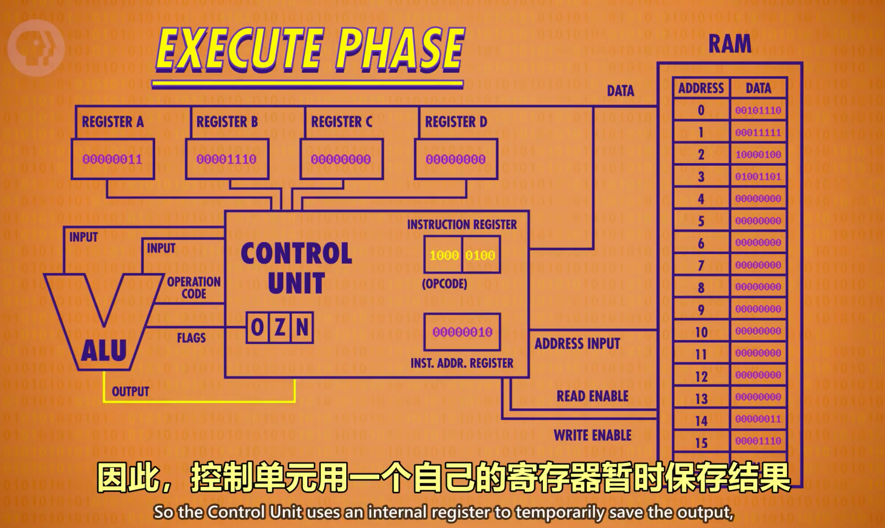

# Computer Science
Study video: [Crash Course Computer Science](https://www.bilibili.com/video/BV1EW411u7th?p=1)
## ALU
ALU has two units: arithmetic unit and logic unit
#### Arithmetic Unit
1. HALF ADDER: handle 1 bit, 2 input
2. FULL ADDER: handle 1 bit, 3 input
3. 8 bit addation: 1 half adder and 7 full adder
3. Overflow: occurs when the result of an addition is too large to be repersented by the number of bits you are using.
4. 8 operations: 
 1. ADD: A and B are summed
 2. ADD with CARRY: A and B and a Carry-In bit are all summed.
 3. SUBTRACT: B is subtracted from A (or vice-versa)
 4. SUBTRACT with BORROW: B is subtracted from A (vice-versa) with borrow (carry-in)
 5. NEGATE: A is subtracted from zero, flipping its sign (from - to +, or + to -)
 6. INCREMENT: Add 1 to A
 7. DECREMENT: Subtract 1 from A
 8. PASS THROUGH: All bits of A are passed

#### Logic Unit
1. Check number is 0
2. Abstract ALU as 'V'
3. Flag (overflow, zero, negative)  

## Rigester And RAM  
Memory: RAM(Random access memmory)/Persistent Memory

1. GatedLatch: store 1 bit.
2. Register: store 8 bits.
3. 16 * 16 = 256
4. Multiplexer: 8 bit address
5. Address: 4 column and 4 rows.

## CPU
CPU: Central Processing Unit

1. Phase of CPU:
 1. Fetch 
 2. Decode 
 3. Excute

## Instructions and Programs
1. Basic instructions:
 1. ADD 
 2. SUB 
 3. JUMP 
 4. LOAD 
 5. HALT

## Algorithms
1. Selection sort: Find the mix and exchange it with first during each loop.
2. Big O notation 
3. Merge sort 
4. Dijkstra: always starts with the node with lowest cost. 
 1. There are 2 sets: S and U, S stores nodes which got the lowest cost to start node, S stores nodes which got the current cost to start node. 
 2. At begin, S is empty and U stores full nodes, but the nodes only have direct wire to start node has cost, other nodes' cost is null. 
 3. The loop is finding the lowest cost node and move it to S, update other nodes left in U with the lowest cost. 
 4. Loop end until U is  empty, and then the nodes in S got their lowest cost to start node. 

 
## Data Structure
 1. Array 
 2. String: An arrray stores chars, end with a zero(binary value 0/null) in merory.
 3. Matrix: Array of arrays. 
 4. Struct: Groups of variables be bundled together.
 5. Pointer: A special variable that points, hence the name, to a location in memory. 
 6. Node: Stores a variable, like a number, and also a pointer.
 7. Linked list: Stores multiple nodes, each node point to the next node in the list. If the list is not circular, the end of list is null.
 8. Queue: FIFO
 9. Stack: LIFO
 10. Tree: Node has several pointers, the top most node is Root Node, node without children nodes is called Leaf Node. One way path from parent to children.
 11. Binary Tree: Node has 2 pointers
 12. Graph: For data that links arbitrary, that include things like loops. Anything can point anything. 
 13. Heap: The relationship between each both parent and children must be same. In Max Heap, the max node is Root Node. 
 14. Red-Black Tree: A type of self-balancing search tree.
  1. A node is either red or black.
  2. The root is black. (This rule is sometimes omitted. Since the root can always be changed from red to black, but not necessarily vice-versa, this rule has little effect on analysis.)
  3. All leaves (NIL) are black. (All leaves are same color as the root.)
  4. Every red node must have two black child nodes.
  5. Every path from a given node to any of its descendant leaves contains the same number of black nodes.

 
